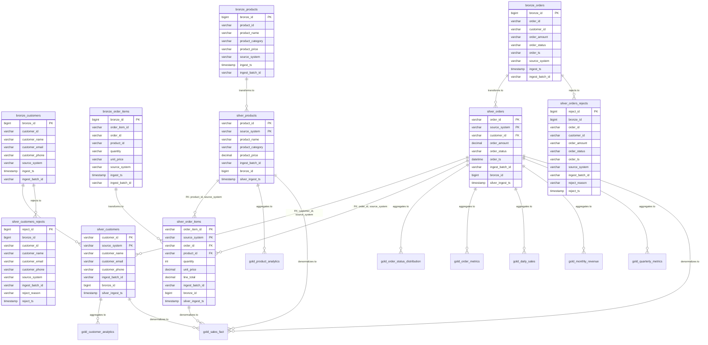

# Medallion Architecture - E-Commerce Data Pipeline

A practical implementation of the Medallion Architecture pattern for data engineering, demonstrating how to structure and process data through bronze (raw), silver (cleaned), gold (analytics-ready), and reject layers using MySQL.

## Overview

This project showcases a real-world approach to implementing the Medallion Architecture pattern, commonly used in data engineering pipelines. The architecture separates data into distinct layers, each serving a specific purpose in the data transformation journey:

- **Bronze Layer**: Raw, unprocessed data ingested as-is from source systems
- **Silver Layer**: Cleaned, validated, and transformed data ready for analytics
- **Gold Layer**: Analytics-ready aggregations and business metrics for reporting
- **Rejects Layer**: Records that fail validation rules, tracked for data quality monitoring

### Current Implementation Status

**Completed (All Layers):**

- ✅ **Bronze Layer**: All 4 main tables (Orders, Customers, Products, Order Items)
- ✅ **Silver Layer**: All 4 main tables with transformation, validation, and rejection handling
- ✅ **Gold Layer**: Complete analytics layer with customer, product, order, time-series, and sales fact tables
- ✅ **Foreign Keys**: All relationships established (orders→customers, order_items→orders, order_items→products)

## Database Schema & Relationships

The following diagram illustrates the medallion architecture layers and relationships between tables:



### Relationship Details

- **Bronze → Silver**: Data flows from bronze (raw) to silver (cleaned) through transformation scripts
- **Bronze → Rejects**: Invalid records for orders and customers are captured in reject tables during transformation (products and order_items do not have reject tables)
- **Silver Orders → Silver Customers**: Foreign key relationship ensures referential integrity
  - Composite FK: `(customer_id, source_system)` → `(customer_id, source_system)`
  - One-to-Many: One customer can have many orders
- **Silver Order Items → Silver Orders**: Foreign key relationship
  - Composite FK: `(order_id, source_system)` → `(order_id, source_system)`
  - One-to-Many: One order can have many order items
- **Silver Order Items → Silver Products**: Foreign key relationship
  - Composite FK: `(product_id, source_system)` → `(product_id, source_system)`
  - Many-to-One: Many order items can reference one product

## Development Environment

### Database

- **MySQL Workbench** (8.0+)
- Database: `testing`

### IDE Setup

While MySQL Workbench is used for database management, development is done using:

- **VS Code** with the **SQL Connector Tool Extension**
- This setup allows connecting to the MySQL instance directly from VS Code without needing to keep MySQL Workbench open, making it easier to work on a single screen and improving development workflow

## Project Structure

```
Medallion Architecture/
├── schema/
│   ├── database_creation.sql           # Database setup
│   ├── ddl_orders_tables.sql          # Orders table definitions (bronze, silver, rejects)
│   ├── ddl_customers_tables.sql       # Customers table definitions (bronze, silver, rejects)
│   ├── ddl_products_tables.sql         # Products table definitions (bronze, silver)
│   ├── ddl_order_items_tables.sql     # Order items table definitions (bronze, silver)
│   ├── ddl_foreign_keys.sql           # Foreign key constraints
│   └── ddl_gold_tables.sql           # Gold layer table definitions
├── bronze/
│   ├── orders/
│   │   └── bronze_orders_load.sql     # Raw orders data ingestion
│   ├── customers/
│   │   └── bronze_customers_load.sql  # Raw customers data ingestion
│   ├── products/
│   │   └── products_load.sql          # Raw products data ingestion
│   └── order_items.sql/
│       └── bronze_order_items_load.sql # Raw order items data ingestion
├── silver/
│   ├── orders/
│   │   ├── silver_orders_transform.sql    # Orders data cleaning and transformation
│   │   └── silver_orders_rejects.sql      # Rejected orders handling
│   ├── customers/
│   │   ├── silver_customers_transform.sql # Customers data cleaning and transformation
│   │   └── silver_customers_rejects.sql   # Rejected customers handling
│   ├── products/
│   │   └── silver_products_transform.sql  # Products data cleaning and transformation
│   └── order_items/
│       └── silver_order_items_transform.sql # Order items data cleaning and transformation
├── gold/
│   ├── customer_analytics_transform.sql    # Customer analytics (CLV, segmentation)
│   ├── product_analytics_transform.sql    # Product analytics (performance, rankings)
│   ├── order_analytics_transform.sql      # Order analytics (status, AOV, metrics)
│   ├── time_series_analytics_transform.sql # Time-series aggregations (daily, monthly, quarterly)
│   └── sales_fact_transform.sql           # Denormalized sales fact table
├── next_steps.md                      # Implementation roadmap and progress
└── README.md
```

## Architecture Layers

### Bronze Layer

**Tables**: `bronze_orders`, `bronze_customers`, `bronze_products`, `bronze_order_items`

- **Purpose**: Store raw, unprocessed data exactly as received from source systems
- **Characteristics**:
  - No data validation or cleaning
  - All fields stored as VARCHAR to preserve original format
  - Includes metadata: `ingest_ts`, `ingest_batch_id`, `bronze_id` (surrogate key)
  - Minimal constraints (only surrogate key)
  - Supports multiple source systems (shopify, amazon, web)

### Silver Layer

**Tables**: `silver_orders`, `silver_customers`, `silver_products`, `silver_order_items`

- **Purpose**: Clean, validated, and typed data ready for analytics
- **Characteristics**:
  - Data type conversion (amounts to DECIMAL, timestamps to DATETIME)
  - Data quality validation (required fields, format checks)
  - Data cleaning (name formatting, phone formatting, email validation)
  - Deduplication logic (keeps most recent record per composite key)
  - Proper constraints and indexes for query performance
  - Foreign key relationships for referential integrity
  - Lineage tracking back to bronze via `bronze_id`
  - Composite primary keys: `(order_id, source_system)`, `(customer_id, source_system)`

### Rejects Layer

**Tables**: `silver_orders_rejects`, `silver_customers_rejects`

- **Purpose**: Track records that fail validation rules
- **Characteristics**:
  - Captures all rejected records from bronze
  - Includes rejection reason for data quality monitoring
  - Maintains full record details for troubleshooting
  - Indexed for efficient querying and reporting

### Gold Layer

**Tables**: `gold_customer_analytics`, `gold_product_analytics`, `gold_product_category_sales`, `gold_order_status_distribution`, `gold_order_metrics`, `gold_daily_sales`, `gold_monthly_revenue`, `gold_quarterly_metrics`, `gold_sales_fact`

- **Purpose**: Business-ready aggregations and metrics for reporting and analytics
- **Characteristics**:
  - Pre-aggregated metrics for fast querying
  - Customer analytics: CLV, segmentation, purchase frequency/recency
  - Product analytics: Performance metrics, popularity rankings, category sales
  - Order analytics: Status distribution, AOV, order metrics
  - Time-series: Daily, monthly, quarterly aggregations with growth metrics
  - Denormalized fact table: Single table combining all dimensions for reporting
  - Optimized indexes for common query patterns
  - Auto-updating timestamps for data freshness tracking

## Execution Order

**Important**: Execute the SQL files in the following order to ensure proper setup and data flow. The order matters because of foreign key dependencies (orders reference customers).

### 1. Database Setup

```sql
-- Run: schema/database_creation.sql
```

- Creates the `testing` database
- Sets the active database context

### 2. Schema Setup - Tables

```sql
-- Run: schema/ddl_customers_tables.sql
-- Run: schema/ddl_orders_tables.sql
-- Run: schema/ddl_products_tables.sql
-- Run: schema/ddl_order_items_tables.sql
-- Run: schema/ddl_foreign_keys.sql
-- Run: schema/ddl_gold_tables.sql
```

**Order matters**: Customers must be created before orders due to foreign key dependency.

- Creates all bronze, silver, gold, and reject tables
- Sets up indexes for optimal query performance
- Establishes foreign key relationships

### 3. Bronze Layer - Data Ingestion

**Execute in this order:**

```sql
-- Step 3a: Load customers first
-- Run: bronze/customers/bronze_customers_load.sql

-- Step 3b: Load orders second (depends on customers for FK validation)
-- Run: bronze/orders/bronze_orders_load.sql
```

- Loads raw data into bronze layer
- Includes sample data with various formats and edge cases
- Contains intentionally invalid data to demonstrate validation logic
- Customers must load before orders due to foreign key constraint

### 4. Silver Layer - Data Transformation

**Execute in this order:**

```sql
-- Step 4a: Transform customers first (no dependencies)
-- Run: silver/customers/silver_customers_transform.sql

-- Step 4b: Transform products second (no dependencies, can run in parallel with customers)
-- Run: silver/products/silver_products_transform.sql

-- Step 4c: Transform orders third (depends on customers)
-- Run: silver/orders/silver_orders_transform.sql

-- Step 4d: Transform order items last (depends on both orders and products)
-- Run: silver/order_items/silver_order_items_transform.sql
```

**Dependencies:**

- **Customers**: No dependencies - can run first
- **Products**: No dependencies - can run independently (after customers for consistency)
- **Orders**: Requires `silver_customers` to exist (FK: customer_id, source_system)
- **Order Items**: Requires both `silver_orders` and `silver_products` to exist (FKs: order_id→orders, product_id→products)

**Customers Transformation:**

- Transforms and cleans customer data from bronze to silver
- Applies name title-casing (first and last name)
- Validates email format with regex
- Formats phone numbers (xxx-xxx-xxxx)
- Validates required fields (customer_id, customer_name, source_system)
- Handles deduplication using business logic

**Products Transformation:**

- Transforms and cleans product data from bronze to silver
- Converts product names to uppercase
- Title-cases product categories
- Validates and converts product prices to DECIMAL(10,2)
- Validates required fields (product_id, product_name, product_category, source_system)

**Orders Transformation:**

- Transforms and cleans order data from bronze to silver
- Applies data type conversions (amounts to DECIMAL, timestamps to DATETIME)
- Multi-format timestamp parsing (ISO 8601, slash format, dash format)
- Validates required fields
- Validates foreign key to customers
- Handles deduplication using business logic (most recent record wins)
- Implements upsert logic for handling updates

**Order Items Transformation:**

- Transforms and cleans order item data from bronze to silver
- Converts quantity to INT and unit_price to DECIMAL(10,2)
- Calculates line_total (quantity × unit_price)
- Validates foreign keys to orders and products (via INNER JOINs)
- Only inserts order items where both order and product exist in silver layer

### 5. Silver Layer - Rejects Processing

**Execute in this order:**

```sql
-- Step 5a: Process customer rejects
-- Run: silver/customers/silver_customers_rejects.sql

-- Step 5b: Process order rejects
-- Run: silver/orders/silver_orders_rejects.sql
```

- Identifies and moves invalid records to the rejects tables
- Categorizes rejection reasons for monitoring
- Should be run after transformation to capture all validation failures

### 6. Gold Layer - Analytics Transformations

**Execute in this order:**

```sql
-- Step 6a: Customer Analytics (no dependencies)
-- Run: gold/customer_analytics_transform.sql

-- Step 6b: Product Analytics (no dependencies, can run in parallel)
-- Run: gold/product_analytics_transform.sql

-- Step 6c: Order Analytics (no dependencies, can run in parallel)
-- Run: gold/order_analytics_transform.sql

-- Step 6d: Time-Series Analytics (no dependencies, can run in parallel)
-- Run: gold/time_series_analytics_transform.sql

-- Step 6e: Sales Fact Table (should run after customer_analytics for accurate segmentation)
-- Run: gold/sales_fact_transform.sql
```

**Execution Order Notes:**
- Customer, product, order, and time-series analytics can run independently (no dependencies)
- Sales fact table should run after customer analytics to ensure accurate customer segmentation
- Each script can be run independently, but sales_fact_transform should run after customer_analytics_transform for accurate segmentation

**Gold Layer Transformations:**

- **Customer Analytics**: Calculates CLV, order history, segmentation (High/Medium/Low value), purchase frequency, and recency
- **Product Analytics**: Calculates product performance metrics, popularity rankings, category sales, and revenue by product
- **Order Analytics**: Calculates order status distribution, AOV, order metrics (min/max order values)
- **Time-Series Analytics**: Daily, monthly, and quarterly aggregations with revenue growth metrics
- **Sales Fact Table**: Denormalized fact table combining orders, order items, customers, and products for efficient reporting

## Key Features Demonstrated

### Data Type Handling

**Orders:**

- **Amounts**: Validates numeric format and converts to DECIMAL(10,2)
- **Timestamps**: Supports multiple formats:
  - ISO 8601: `2023-01-01T09:00:00Z`
  - Standard: `2023-01-01 09:00:00`
  - Slash format: `2023/01/01 10:00` or `2023/01/01 10:00:00`
  - Dash format: `01-15-2023 13:00:00` (MM-DD-YYYY)

**Customers:**

- **Names**: Title-cases first and last names (e.g., "JOHN DOE" → "John Doe")
- **Emails**: Validates format using regex pattern
- **Phones**: Formats to standard xxx-xxx-xxxx format, rejects invalid formats

### Deduplication Strategy

- Uses `ROW_NUMBER()` with partitioning by composite keys:
  - Orders: `(order_id, source_system)`
  - Customers: `(customer_id, source_system)`
- Orders by:
  1. Business timestamp (most recent first)
  2. Ingestion timestamp (fallback for tie-breaking)
  3. Bronze ID (deterministic final tie-breaker)

### Upsert Logic

- Uses `ON DUPLICATE KEY UPDATE` to handle record updates
- Only updates if incoming record is newer (by timestamp or bronze_id)
- Preserves existing data when incoming data is older

### Foreign Key Relationships

- **One-to-Many**: One customer can have many orders
- Foreign key on `silver_orders` references `silver_customers`
- Composite foreign key: `(customer_id, source_system)` → `(customer_id, source_system)`
- Ensures referential integrity between orders and customers

### Validation Rules

**Orders are rejected if:**

- Both `order_id` AND `source_system` are missing
- `order_id` is missing
- `source_system` is missing
- `customer_id` is missing

**Customers are rejected if:**

- `customer_id` is missing
- `customer_name` is missing
- `source_system` is missing
- Combinations of missing required fields

## Use Cases

This implementation demonstrates:

- **Data Quality**: How to handle dirty data and track quality issues
- **Data Lineage**: Tracking data from source through transformations
- **Incremental Processing**: Handling updates and deduplication
- **Error Handling**: Capturing and categorizing data quality issues
- **Referential Integrity**: Foreign key relationships and validation
- **Data Cleaning**: Name formatting, phone formatting, email validation
- **Production Patterns**: Real-world approaches used in data engineering roles

## Notes

- **Load Order**: Always load customers before orders due to foreign key dependency
- **Foreign Key Checks**: The transformation scripts temporarily disable foreign key checks (`SET FOREIGN_KEY_CHECKS = 0`) to allow `TRUNCATE` operations. This is acceptable in this full reload scenario where we're completely refreshing the silver layer. **For incremental loads in production, use `DELETE` with proper ordering instead of `TRUNCATE` to maintain referential integrity without disabling constraints.**
- **Test Data**: Bronze load files include test data with various edge cases
- **Invalid Records**: Some records are intentionally invalid to demonstrate validation and rejection logic
- **Upsert Testing**: Bronze load files include duplicate records to test the upsert/update logic
- **Data Preservation**: All timestamps in bronze are stored as VARCHAR to preserve original format
- **Multi-Source**: Supports multiple source systems (shopify, amazon, web) with composite keys

## Future Enhancements

See `next_steps.md` for the roadmap. The Gold layer is now complete with:

- ✅ Customer analytics (CLV, segmentation, purchase frequency)
- ✅ Product analytics (performance metrics, popularity rankings)
- ✅ Order analytics (status distribution, AOV, metrics)
- ✅ Time-series aggregations (daily, monthly, quarterly)
- ✅ Denormalized sales fact table for reporting

## Contributing

This is a learning project designed to showcase medallion architecture patterns. Feel free to use this as a reference or starting point for your own implementations.
